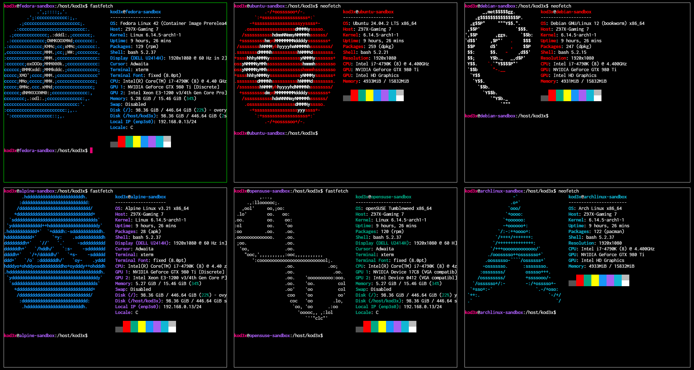

<div align="center">
    
    <br>
    <br>
    <strong>Everything is removed when the shell is closed.</strong>
</div>

<br>

<div align="center">
    <a href="#-features">Features</a> · <a href="#-installation">Installation</a> · <a href="#-usage">Usage</a> · <a href="#-for-developers">For developers</a>
</div>

<br>

<p>
    Sandbox is a command-line tool that makes it easy to create and manage containers for testing and experimentation in isolated environments. With Sandbox, you can quickly deploy ephemeral or persistent containers, customizing their configuration with GPU support, custom volume mounting, and the ability to install programs with graphical environment. By default, it mounts the current directory, but you can also choose to completely isolate the container. In addition, you can make containers persistent by assigning them a name. This tool is inspired by <a href="https://distrobox.it">Distrobox</a>.
</p>

<br>

<div align="center">
    
</div>

<br>

# 🧩 Features

- **Temporary containers by default**: Containers are removed after exit unless a name is assigned.
- **Persistent containers**: Assign a custom name to preserve the container across sessions.
- **Automatic mounting of the current directory**: The current working directory is mounted at `/host/<current_dir>` by default, unless `--isolate` is used.
- **Full isolation**: Use `--isolate` to prevent mounting the current directory and run in a fully isolated environment.
- **Optional home directory mount**: Use `--home` to mount your home directory at `/host/home`.
- **GPU support**: Enable NVIDIA GPU access with the `--nvidia` option.
- **Custom docker socket**: Use `--docker-socket` to mount the Docker socket inside the container.
- **Custom volumes**: Mount additional volumes as needed.

# 📦 Installation

```bash
curl -s https://raw.githubusercontent.com/KOD3X/sandbox/main/install | sudo bash
```

# 🎮 Usage

### By default

- Current Directory is mounted on `/host/<current_dir>`, if you don't want to mount it, use `--isolate`.
- Home Directory is NOT mounted, if you mount it, it will be mounted on `/host/home/<username>`.
- The real home directory is `/home/<username>`, this is so as not to affect the real home directory.

### Table of options and directory mounts

| Option   | Current Dir | Home Dir | Use case                                                |
| -------- | ----------- | -------- | ------------------------------------------------------- |
|          | Yes         | No       | You want to work in the current directory               |
| `-h`     | Yes         | Yes      | You need to work with various directories and files     |
| `-i`     | No          | No       | You want to test something in a secure environment      |
| `-i -h ` | No          | Yes      | You want to test something but need various directories |

## Examples

#### Create an ephemeral sandbox container with the current directory mounted

```bash
sandbox fedora
```

#### Make it non-ephemeral

```bash
sandbox alpine --name my-alpine
```

#### Add nvidia support

```bash
sandbox ubuntu --nvidia
```

#### Create it without current directory mounted

```bash
sandbox opensuse/tumbleweed --isolate
```

# 🧹 Uninstallation

```bash
sandbox-uninstall
```

# 💻 For developers

Install development version of sandbox:

```bash
make dev
```

Remove sandbox installation:

```bash
make rm
```

# 🐧 Tested distributions

- [x] [Arch Linux](https://hub.docker.com/_/archlinux/tags)
- [x] [Alpine](https://hub.docker.com/_/alpine/tags)
- [x] [Debian](https://hub.docker.com/_/debian/tags)
- [x] [Fedora](https://hub.docker.com/_/fedora/tags)
- [x] [Ubuntu](https://hub.docker.com/_/ubuntu/tags)
- [x] [OpenSUSE/Tumbleweed](https://hub.docker.com/r/opensuse/tumbleweed/tags)
- [x] [OpenSUSE/Leap](https://hub.docker.com/r/opensuse/leap/tags)
- [x] [AlmaLinux](https://hub.docker.com/_/almalinux)
- [ ] [NixOS](https://hub.docker.com/r/nixos/nix/tags)
- [x] [Rocky Linux](https://hub.docker.com/_/rockylinux/tags)
- [ ] [Gentoo/stage3](https://hub.docker.com/r/gentoo/stage3/tags)
- [x] [Mageia](https://hub.docker.com/_/mageia/tags)
